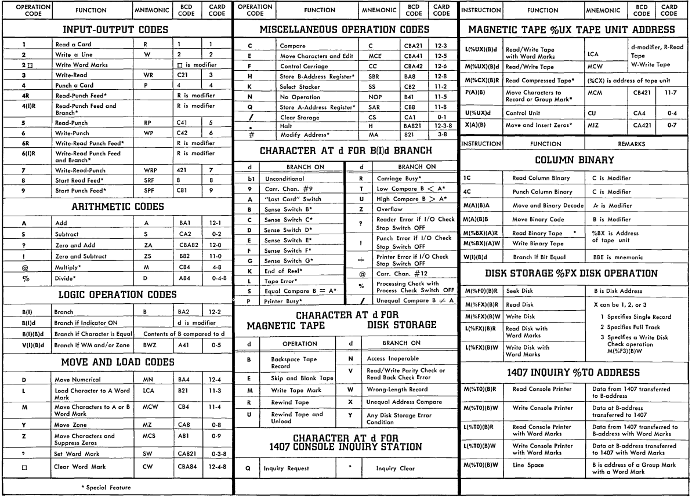

# n1401
Trying to write a modern assembler for the 1401

# Compiling
only make and g++ required.

``make build`` results in a singular main.exe

# assembler
``n1401 main.S -o main.o``

## options

| -   | desc |
| --- | ---- |
| -h  | help menu |
| -v  | version |
| -o  | specify an output file |
| -g  | specify a format (only rawtape for now lol) |

# programming

``/examples`` should explain everything poggar
- helloworld.S

## instructions

see doc/README.md for more

there is also a not very useful instruction reference [1401 proggraming student materials](http://www.bitsavers.org/pdf/ibm/1401/R29-0044-2_1401_Symbolic_Programming_System_Student_Materials.pdf)