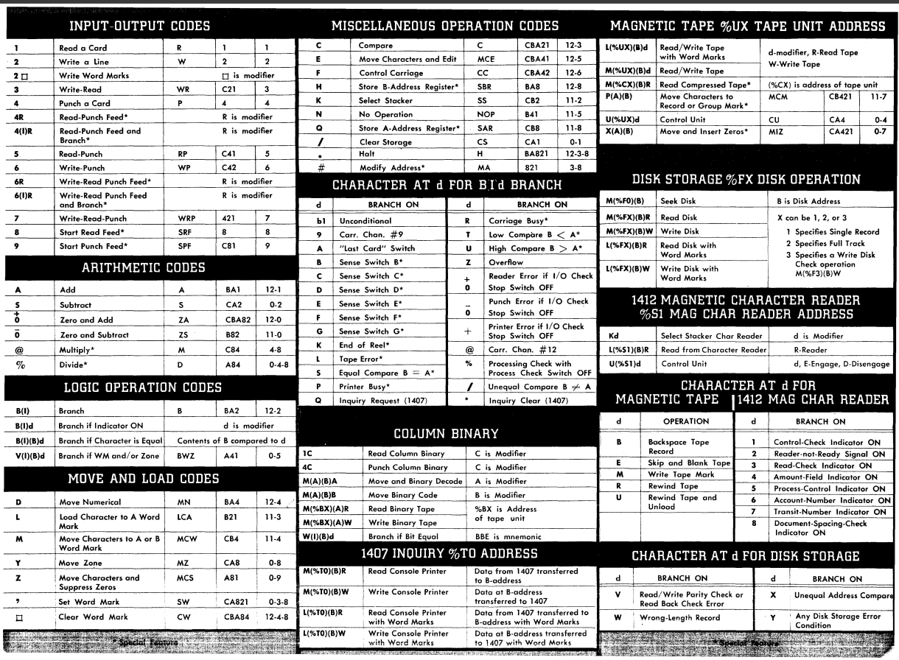
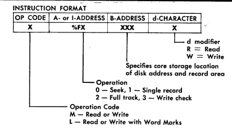

# n1401
Trying to write a modern assembler for the 1401

# assembler
``n1401 main.S -o main.o``
## options

| -   | desc |
| --- | ---- |
| -h  | help menu |
| -v  | version |
| -o  | specify an output file |
| -g  | specify a format: (raw, rawtape, simh, simh_old) default raw |

# programming
## word marks
you can view memory like
```c
struct byte_1401 {
  uint6_t character; // I believe it is 6 bits? I dont know for sure
  bool marked; // if there is a mark here
};
```
you can set word marks manually by placing ``.`` after the byte you want word marked

like ``db "HELLO WORLD".`` ``D`` is marked

or ``db "HELLO" . " WORLD"`` ``O`` is marked

you can also place ``,`` before the byte you want to mark

like ``db , "HELLO WORLD"`` ``H`` is marked

or ``db "HELLO " , "WORLD"`` ``W`` is marked

## addresses
Addresses are 3 characters long

``000``: 0

``050``: 50

``A00``: 100

``B00``: 200

``B05``: 205
## instructions




there is also a not very useful instruction reference [1401 proggraming student materials](http://www.bitsavers.org/pdf/ibm/1401/R29-0044-2_1401_Symbolic_Programming_System_Student_Materials.pdf)

todo: make a instruction reference here lol